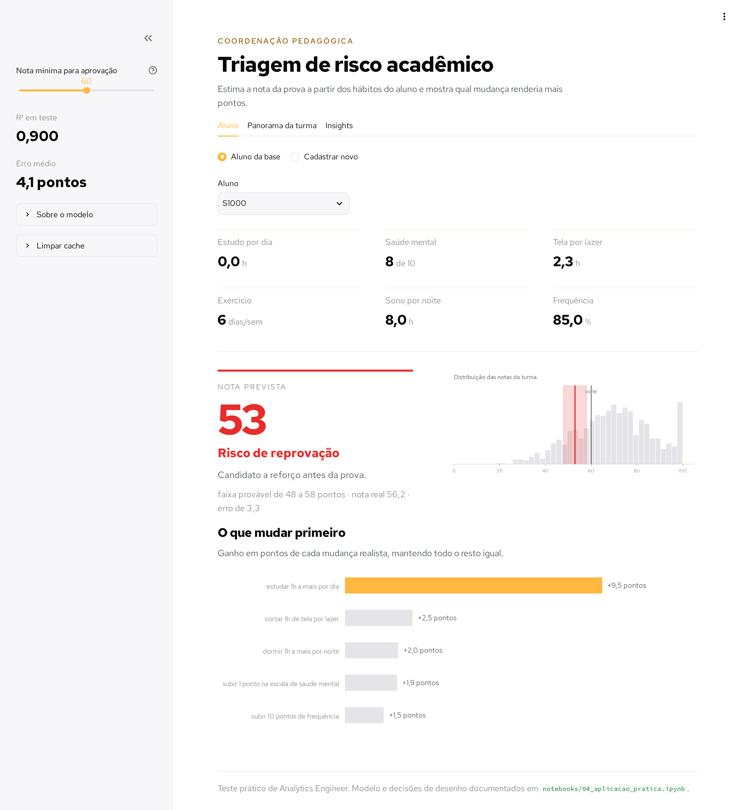

# Hábitos e desempenho estudantil

Análise de 1.000 alunos relacionando hábitos (estudo, sono, tela, exercício, saúde mental) com a nota de prova, e um app que transforma o resultado em ferramenta de triagem.

Teste prático de Analytics Engineer (estágio).

**App publicado:** _(preencher com a URL do Streamlit Cloud após o deploy)_



---

## Como rodar

O Python do sistema costuma recusar instalação de pacote (PEP 668), então o venv não é preferência, é requisito.

### O app

```bash
python3 -m venv .venv
source .venv/bin/activate
pip install -r requirements.txt
streamlit run app.py
```

### Os notebooks

```bash
pip install -r requirements-dev.txt
jupyter lab
```

O `requirements.txt` é enxuto de propósito, com só o que o app precisa, porque é ele que o Streamlit Cloud instala no deploy. O Jupyter vive no `requirements-dev.txt`.

Os notebooks estão salvos **com as saídas**, então dá para ler tudo direto no GitHub sem rodar nada.

### A verificação

```bash
python tests/teste_notebooks.py
```

São 114 verificações: integridade dos arquivos, igualdade da base preparada entre os notebooks, recálculo de 33 números afirmados no texto, presença desses números no markdown, e o app. Com `--executar` inclui rodar os seis notebooks do zero, somando 120.

---

## Como foi estruturado

Um notebook por tarefa do desafio, cada um fechando com o gancho para o seguinte.

| Notebook | O que responde | Achado que mudou a análise |
|---|---|---|
| [01 Exploração inicial](notebooks/01_exploracao_inicial.ipynb) | A base é confiável? | O `read_csv` padrão **fabrica 91 ausentes** que o arquivo não tem |
| [02 Engenharia de dados](notebooks/02_engenharia_de_dados.ipynb) | Que variáveis criar? | Seis de sete derivadas **pioram** o sinal |
| [03 Análise estatística](notebooks/03_analise_estatistica.ipynb) | O que explica a nota? | A correlação simples **subestima** todo hábito que não seja estudo |
| [04 Aplicação prática](notebooks/04_aplicacao_pratica.ipynb) | O que dá para fazer? | Perto da linha de corte o modelo acerta 67,5%, **pior que chutar** |
| [05 Visualização](notebooks/05_visualizacao.ipynb) | Como comunicar? | Abaixo de 2h de estudo, **94% reprovam**; de 5h em diante, ninguém |
| [06 Síntese de insights](notebooks/06_sintese_de_insights.ipynb) | Há diferença entre grupos? | **Nenhuma**, exceto saúde mental |

```
app.py                  app Streamlit, autocontido
notebooks/              os seis notebooks, executados
data/raw/               o CSV original, intocado
tests/                  a verificação
assets/fonts/           Red Hat Text, para os gráficos usarem a fonte da interface
docs/                   capturas do app
.streamlit/config.toml  tema
```

Nenhuma base tratada é gravada em disco. Os notebooks 02 a 06 e o app compartilham a mesma função `preparar_dados()`, e o teste confere que os cinco chegam a um DataFrame idêntico.

---

## O app

Três abas, feitas para a coordenação pedagógica.

**Aluno.** Escolhe alguém da base ou cadastra um novo e recebe a nota prevista, o veredito e o simulador de intervenção, que ordena as mudanças de hábito por quantos pontos cada uma renderia.

**Panorama da turma** ([captura](docs/app-panorama.png)). Seletor de hábito com dois painéis sobre o mesmo eixo de faixas: em cima a nota de cada faixa, embaixo quantos ficam abaixo do corte. Mais o mapa de calor de correlação.

**Insights** ([captura](docs/app-insights.png)). Impacto de cada hábito em pontos, um comparador que responde "há diferença entre grupos?" para qualquer recorte, e as recomendações.

### O veredito tem três estados, e o terceiro é o que importa

O modelo acerta 92,1% dos vereditos, contra 72,0% de simplesmente chutar que todo mundo passa. Mas essa é uma média, e ela esconde onde o modelo erra:

| Distância da linha de corte | Alunos | Acerto |
|---|---|---|
| **até 5,1 pontos** | 203 | **67,5%** |
| 5,1 a 10,1 | 196 | 93,9% |
| 10,1 a 15,2 | 199 | 99,5% |
| mais de 15,2 | 402 | 100% |

Perto do corte o modelo fica **pior que não ter modelo nenhum**. São 20% da turma. Esses casos aparecem como **zona de incerteza** em vez de receberem um veredito falsamente confiante, e é justamente neles que vale gastar atenção humana.

---

## As conclusões

### Quais hábitos mais afetam as notas

| Posição | Hábito | r simples | r parcial | Pontos por desvio |
|---|---|---|---|---|
| 1 | Horas de estudo | +0,825 | referência | **+14,1** |
| 2 | Saúde mental | +0,322 | **+0,575** | +5,6 |
| 3 | Tempo de tela | -0,238 | **-0,412** | -3,9 |
| 4 | Exercício | +0,160 | +0,326 | +2,9 |
| 5 | Sono | +0,122 | +0,256 | +2,5 |
| 6 | Frequência às aulas | +0,090 | +0,121 | +1,4 |

Sem efeito detectável: escolaridade dos pais, qualidade da internet, trabalho de meio período, qualidade da dieta, idade e atividade extracurricular. Em todas, o intervalo de 95% da correlação contém o zero.

**A coluna do meio é a que muda a conversa.** Horas de estudo sozinha ocupa 68% da variação da nota, o que faz todo o resto parecer irrelevante quando medido contra o total. Entre alunos que estudam a mesma quantidade, saúde mental explica 0,575 do que sobra.

### Recomendações práticas

1. **Priorizar quem estuda menos de 3h por dia.** São 334 alunos, um terço da turma. Abaixo de 2h, 94% ficam abaixo de 60; entre 2h e 3h são 51%. Tirar um aluno de 2h para 3h derruba o risco de **51% para 16%**.
2. **Tratar saúde mental como variável acadêmica.** Segundo maior efeito, maior entre os que uma escola consegue influenciar, e único recorte de grupo com diferença real.
3. **Negociar tempo de tela.** Cada hora a menos vale 2,5 pontos, e a mediana da turma está em 4,4 horas por dia.

O maior número não é a melhor recomendação. Horas de estudo lidera todas as métricas e é a mais difícil de mudar por conversa: "estude mais uma hora por dia" é o conselho que todo aluno em dificuldade já ouviu. Saúde mental e tela aparecem acima apesar de efeitos menores porque têm caminho de ação.

### Há diferença entre grupos?

**Não, com uma exceção.**

| Recorte | Amplitude | Em desvios |
|---|---|---|
| Qualidade da alimentação | 2,30 pts | 0,14 |
| Escolaridade dos pais | 2,19 pts | 0,13 |
| Qualidade da internet | 2,00 pts | 0,12 |
| Gênero | 1,28 pts | 0,08 |
| Trabalha meio período | 1,09 pts | 0,06 |
| Atividade extracurricular | 0,03 pts | 0,00 |
| **Saúde mental** | **15,6 pts** | **0,92** |

As maiores diferenças demográficas nem sequer são monótonas: quem come *Fair* tira mais que quem come *Good*, e internet *Average* supera *Good*. Efeito real apareceria como gradiente, não como zigue-zague.

Saúde mental é o único agrupamento com gradiente limpo e amplitude relevante, doze vezes a diferença de gênero.

---

## O que esta base não permite concluir

**Nada aqui estabelece causa.** Todas as medidas são de associação. O simulador responde "o que o modelo prevê se esse número mudar", não "o que acontece se o aluno mudar de hábito".

**Os hábitos desta base são independentes entre si**, com correlação máxima de 0,072 entre 89 pares. Em estudantes reais eles vêm em pacote: quem dorme mal costuma estudar menos e usar mais tela à noite.

**A base é sintética.** Distribuições suaves, três variáveis quase uniformes, zero duplicata, zero valor fora de domínio, zero rótulo inconsistente. As conclusões valem como exercício analítico, e não como achado sobre estudantes reais.

**A nota está censurada no topo.** 48 alunos com exatamente 100, o que atenua todas as correlações relatadas. Os números aqui são piso, não valor exato, e o notebook 03 mostra que descartar esses alunos piora a estimativa em vez de corrigi-la.

---

## Publicar o app

O app foi feito para o [Streamlit Community Cloud](https://share.streamlit.io), que é gratuito e lê direto deste repositório.

1. Entrar em `share.streamlit.io` com a conta do GitHub
2. Apontar para este repositório, branch `main`, arquivo `app.py`
3. Em configurações avançadas, escolher **Python 3.12 ou superior** (o `numpy` fixado exige 3.12)
4. Publicar

Três detalhes do repositório existem para que esse deploy funcione sem ajuste: o `requirements.txt` não carrega o Jupyter, o caminho do CSV é resolvido a partir do próprio `app.py` em vez do diretório de execução, e o tema está em `.streamlit/config.toml` em vez de CSS injetado.
