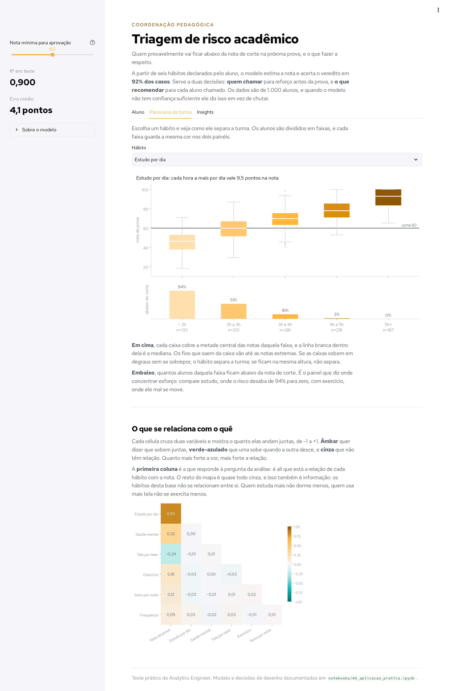
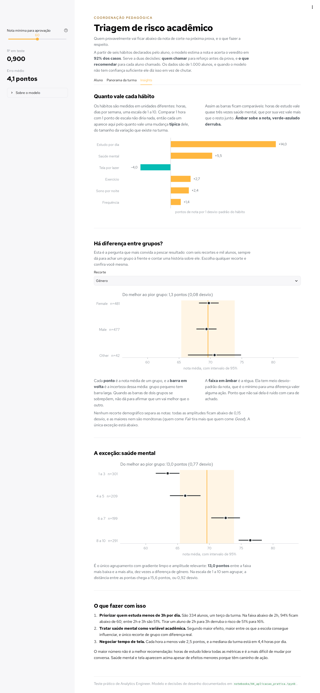

# Hábitos e desempenho estudantil

Uma [base](data/raw/habitos_e_desempenho_estudantil.csv) de 1.000 alunos relaciona hábitos de estudo, sono, tempo de tela, exercício e saúde mental com a nota de prova. O projeto explora os dados, mede as principais associações, constrói um modelo preditivo e disponibiliza uma ferramenta para apoio à coordenação pedagógica.

<div align="center">

**[Abrir o site](https://data-analysis-007.streamlit.app/) · Triagem de risco acadêmico**

</div>


---

## Sumário

* [Como rodar](#como-rodar)
* [Estrutura de pastas](#estrutura-de-pastas)
* [Os notebooks](#os-notebooks)
* [O app](#o-app)
* [Principais conclusões](#principais-conclusões)
* [Limitações](#limitações)
* [A verificação](#a-verificação)

---

## Como rodar

### App

```bash
python3 -m venv .venv
source .venv/bin/activate
pip install -r requirements.txt
streamlit run app.py
```

### Notebooks

```bash
pip install -r requirements-notebooks.txt
jupyter lab
```

Os notebooks estão salvos **com as saídas**, então podem ser consultados diretamente pelo GitHub.

### Testes

```bash
python tests/teste_notebooks.py
```

Para executar também os notebooks do zero:

```bash
python tests/teste_notebooks.py --executar
```

---

## Estrutura de pastas

```text
app.py                       # aplicação Streamlit
README.md                    # documentação do projeto

data/
  raw/
    habitos_e_desempenho_estudantil.csv  # base original, nunca alterada

notebooks/                   # análises do projeto
  01_exploracao_inicial.ipynb           # exploração e qualidade dos dados
  02_engenharia_de_dados.ipynb          # preparação e transformação dos dados
  03_analise_estatistica.ipynb          # correlações e diferenças entre grupos
  04_aplicacao_pratica.ipynb            # construção e avaliação do modelo
  05_visualizacao.ipynb                 # visualizações dos resultados
  06_sintese_de_insights.ipynb          # conclusões e recomendações

tests/
  teste_notebooks.py         # testes de consistência do projeto

assets/
  fonts/                     # fontes utilizadas nos gráficos
  img/                       # imagens do app e dos notebooks

.streamlit/
  config.toml                # configuração visual do Streamlit

requirements.txt             # dependências necessárias para o app
requirements-notebooks.txt   # dependências do app + Jupyter
```

O projeto não possui `data/processed/`: os notebooks e o app compartilham a mesma função `preparar_dados()`, evitando manter uma base tratada que poderia ficar desatualizada.

---

## Os notebooks

| Notebook                                                           | Etapa                                 |
| ------------------------------------------------------------------ | ------------------------------------- |
| [01 — Exploração inicial](notebooks/01_exploracao_inicial.ipynb)   | Exploração e qualidade dos dados      |
| [02 — Engenharia de dados](notebooks/02_engenharia_de_dados.ipynb) | Preparação das variáveis              |
| [03 — Análise estatística](notebooks/03_analise_estatistica.ipynb) | Correlações e diferenças entre grupos |
| [04 — Aplicação prática](notebooks/04_aplicacao_pratica.ipynb)     | Modelo preditivo                      |
| [05 — Visualização](notebooks/05_visualizacao.ipynb)               | Visualizações                         |
| [06 — Síntese de insights](notebooks/06_sintese_de_insights.ipynb) | Conclusões e recomendações            |

---

## O app

O aplicativo possui três áreas principais:

**Aluno:** seleciona ou cadastra um aluno e visualiza a nota prevista, o risco acadêmico e um simulador de intervenção.

**Panorama da turma:** explora a distribuição das notas por hábito e o mapa de correlações.



**Insights:** apresenta os principais resultados estatísticos, comparações entre grupos e recomendações.



### Zona de incerteza

O modelo acerta **92,1%** dos vereditos, contra **72,0%** de uma estratégia que classifica todos como aprovados.

Porém, perto do corte de 60 pontos, o desempenho cai:

| Distância do corte | Alunos |    Acerto |
| ------------------ | -----: | --------: |
| **até 5,1 pontos** |    203 | **67,5%** |
| 5,1 a 10,1         |    196 |     93,9% |
| 10,1 a 15,2        |    199 |     99,5% |
| mais de 15,2       |    402 |      100% |

Por isso, os 203 alunos mais próximos do corte são tratados como **zona de incerteza**, priorizando a avaliação humana.

---

# Principais conclusões

## Hábitos e desempenho

| Hábito              |  r simples |  r parcial | Pontos por desvio |
| ------------------- | ---------: | ---------: | ----------------: |
| **Horas de estudo** | **+0,825** | referência |         **+14,1** |
| Saúde mental        |     +0,322 | **+0,575** |              +5,6 |
| Tempo de tela       |     -0,238 | **-0,412** |              -3,9 |
| Exercício           |     +0,160 |     +0,326 |              +2,9 |
| Sono                |     +0,122 |     +0,256 |              +2,5 |
| Frequência às aulas |     +0,090 |     +0,121 |              +1,4 |

As horas de estudo apresentam a maior associação com a nota. Ao controlar por horas de estudo, saúde mental mantém uma associação relevante, passando de **0,322 para 0,575**.

Não houve efeito detectável, nesta análise, para escolaridade dos pais, qualidade da internet, trabalho de meio período, qualidade da dieta, idade e atividade extracurricular.

## Recomendações

1. **Priorizar alunos que estudam menos de 3h/dia.** São 334 alunos. Entre quem estuda de 2h a 3h, 51% ficam abaixo de 60 pontos; entre quem estuda 3h ou mais, são 16%.

2. **Acompanhar saúde mental.** É a segunda maior associação parcial e o único recorte de grupos com diferença de médias relevante. Apesar de horas de estudo apresentarem uma associação maior, saúde mental se destaca por ser um aspecto sobre o qual a escola pode atuar diretamente, além de ser uma frente de intervenção mais viável do que simplesmente pedir ao aluno que estude mais.

3. **Observar tempo de tela.** A correlação parcial é **-0,412** e a mediana da turma é de **4,4 horas por dia**.

> Esses resultados representam associações observadas na base e não comprovam que mudar um hábito causará determinada mudança na nota.


## Há diferença entre grupos?

| Recorte                   |    Amplitude | Em desvios |
| ------------------------- | -----------: | ---------: |
| Qualidade da alimentação  |     2,30 pts |       0,14 |
| Escolaridade dos pais     |     2,19 pts |       0,13 |
| Qualidade da internet     |     2,00 pts |       0,12 |
| Gênero                    |     1,28 pts |       0,08 |
| Trabalha meio período     |     1,09 pts |       0,06 |
| Atividade extracurricular |     0,03 pts |       0,00 |
| **Saúde mental**          | **15,6 pts** |   **0,92** |

A amplitude é a diferença entre a maior e a menor média dos grupos. Saúde mental apresenta a maior diferença, de **15,6 pontos**, equivalente a **0,92 desvio-padrão**.

---

## Limitações

**Correlação não é causalidade.** O modelo mostra como a previsão muda quando os valores são alterados, mas isso não significa que a mudança realmente causaria esse efeito no aluno.

**Os resultados dependem desta base.** Os padrões encontrados não devem ser generalizados automaticamente para outras populações.

---

## A verificação

`tests/teste_notebooks.py` realiza **114 verificações** na execução padrão e **120** com `--executar`.

Ele verifica:

1. **Integridade:** notebooks, células, links e imagens.
2. **Consistência da base:** os notebooks chegam ao mesmo DataFrame preparado.
3. **Recálculo:** refaz os principais resultados numéricos.
4. **Texto:** verifica se os valores calculados aparecem nos notebooks.
5. **App:** testa as principais telas, seletores e interações.
6. **Execução:** com `--executar`, roda os seis notebooks do zero.
